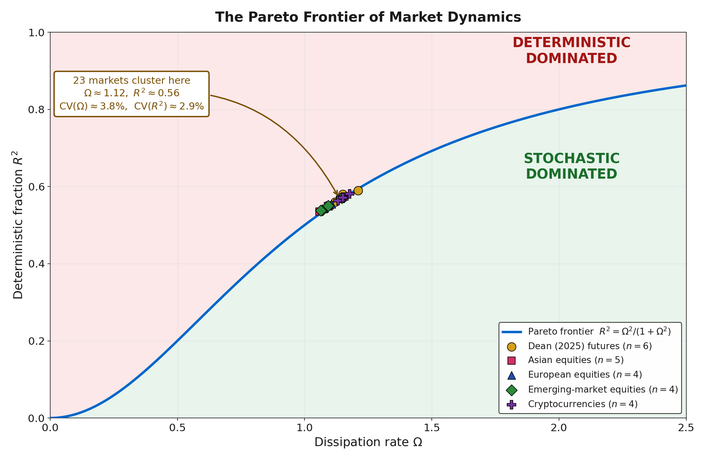
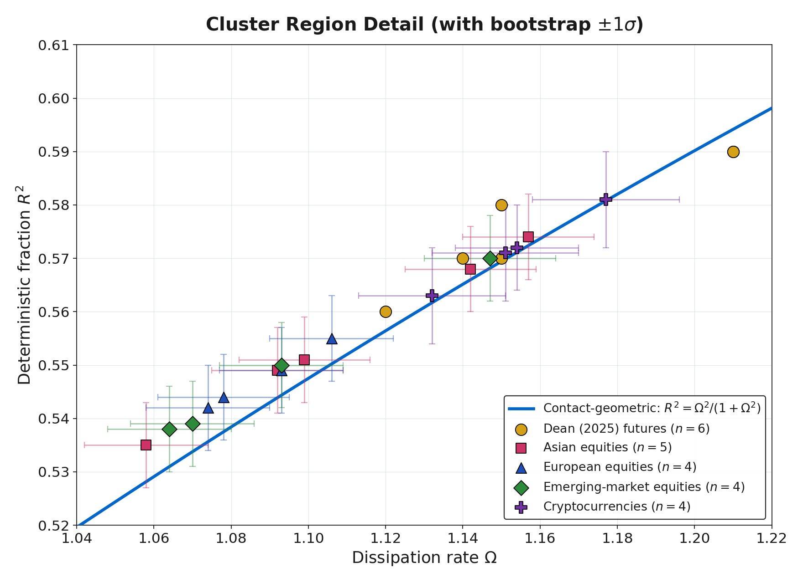
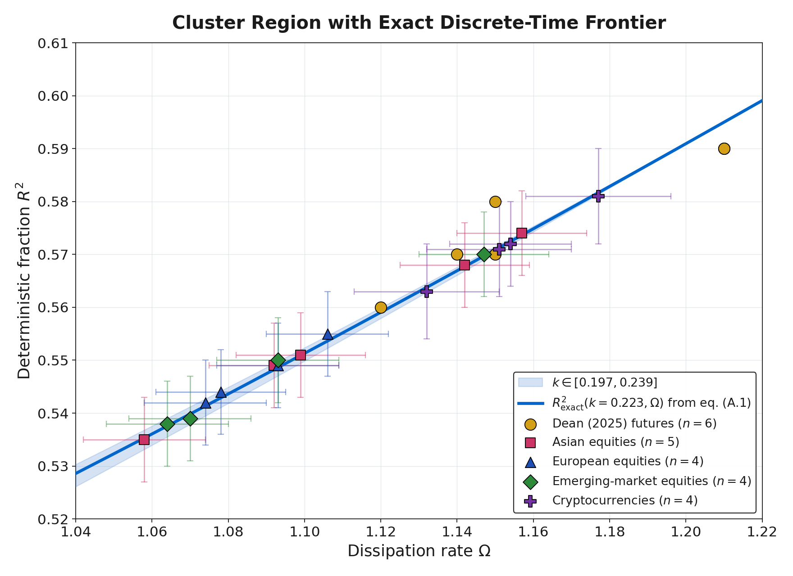
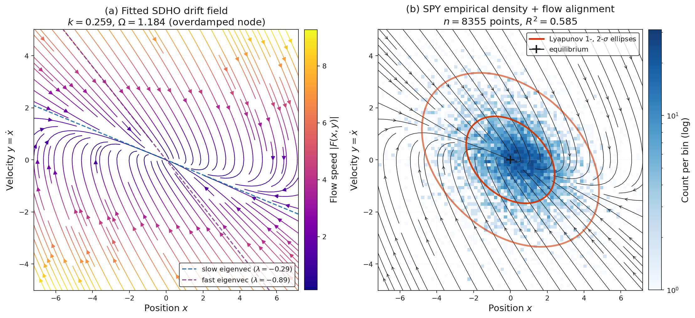

# Information Geometry of Market Dynamics: A Pareto Frontier from Contact Geometry

**Bruce H. Dean, Ph.D.**[^affil]\
NASA Goddard Space Flight Center, Greenbelt, MD, USA\
ORCID: 0009-0008-8153-3269\
symplectic.research@gmail.com

[^affil]: Supporting the Habitable Worlds Observatory (HWO) mission development under contract.

April 2026 (Draft v0.57)

---

## Abstract

In earlier work [1, 2] we established the two-dimensional Ornstein-Uhlenbeck process governing the stochastic damped harmonic oscillator (SDHO) as a dynamical model for liquid financial markets. Here we derive a closed-form Pareto frontier $R^2 = \Omega^2/(1+\Omega^2)$ between the dissipation rate $\Omega$ (the normalized rate at which the market dissipates momentum shocks) and the deterministic fraction $R^2$ of momentum-acceleration variance at fluctuation-dissipation-balanced stationarity. Three geometric structures imply this relation: the Fisher information metric on the parameter manifold, unique by Čencov's theorem; the contact-extended entropy production $\dot{s} = \Omega y^2$ of stochastic thermodynamics; and the fluctuation-dissipation theorem coupling noise to dissipation. The critical point $(\Omega = 1, R^2 = 1/2)$ separates deterministic from stochastic-dominated regimes and market data supplies the empirical test: SDHO dynamics have been identified across six futures markets [1] and 462 years of equity history [2], and here we extend the validation to seventeen further markets spanning Asian, European, emerging-market, and cryptocurrency instruments. All twenty-three markets sit on the exact frontier to within $4.5 \times 10^{-4}$ in $R^2$, with a coefficient of variation below 3% in both $\Omega$ and $R^2$. A candidate sweep targeting the underdamped regime identifies the Pakistan KSE-100 index at $\Omega = 0.978 \pm 0.027$, straddling the critical point and conforming to the exact frontier to within $10^{-3}$ in $R^2$, the first liquid market located at the edge of the underdamped region. Short-horizon anti-persistence, the variance risk premium, and the missing quantitative content of the adaptive-markets hypothesis follow as structural corollaries of the same geometric source, delivering a geometric resolution of the random-walk-versus-structure debate in financial economics at an interior operating point $R^2 \approx 0.57$.

**Keywords:** information geometry; Fisher metric; statistical manifold; contact geometry; Pareto frontier; stochastic damped harmonic oscillator; fluctuation-dissipation theorem (FDT); stochastic thermodynamics; entropy production; Čencov's theorem

---

## 1. Introduction

The significance of a geometric theory lies in its ability to derive structure from principles rather than fit patterns to data. This becomes especially valuable when statistical inference is limited, due to noise or otherwise limited data. In this paper we develop such a framework for a two-dimensional Ornstein-Uhlenbeck (OU) process at stationarity, which we identified in earlier work [1, 2] as the dynamical model for liquid financial markets.

Three features of the OU-at-stationarity setup each admit a canonical geometric formulation, making the step from dynamical system to geometry shorter than it first appears. *What is the natural metric on a family of probability distributions?* By Čencov's theorem [13], with foundational prior work by Rao [18] and the modern systematic development in Amari [19], the Fisher information metric is the unique invariant Riemannian structure on the parameter manifold $(k, \Omega, \sigma)$. *What geometry governs a dissipative flow?* Not the symplectic geometry of Hamiltonian mechanics, but its generalization to systems with an entropy coordinate: contact geometry [20], in which $\Omega$ appears as the coupling constant of entropy production $\dot{s} = \Omega y^2$. *What balance closes a driven-dissipative system at stationarity?* The fluctuation-dissipation theorem (FDT) [14, 15], which forces the diffusion to compensate the phase-space contraction from dissipation. The theorem of §3 is what these three structures together force.

The result is the Pareto frontier

$$R^2 \;=\; \frac{\Omega^2}{1 + \Omega^2} \tag{1}$$

between dissipation rate $\Omega$ and deterministic variance fraction $R^2$ and a critical point $R^2 = 1/2$ at $\Omega = 1$, separating deterministic-dominated from stochastic-dominated regimes. The reported $R^2$ is the deterministic fraction of momentum-acceleration variance, the share of $\Delta y$ predictable from current phase-space state under the SDHO drift, not a measure of return predictability or tradable alpha. This paper is the third in a series [1, 2] that derives the SDHO structure by applying phase-space methods and statistical mechanics to market dynamics, and the present geometric result is the culmination of that empirical groundwork.

Formalizing the dynamical object makes the theorem precise. The SDHO, written as a Langevin equation in the phase-space coordinates $(x, y) = (x, \dot{x})$, reads

$$dy \;=\; \underbrace{-k x \, dt - \Omega y \, dt}_{\text{DHO (deterministic)}} \;+\; \underbrace{\sigma \, dW}_{\text{noise (stochastic)}},\qquad \dot{x} = y,$$

an OU process on a two-dimensional phase space [3] with deterministic restoring force $-kx$, dissipative term $-\Omega y$, and stochastic forcing $\sigma \, dW$. The deterministic drift field alone, $-kx - \Omega y$, is the damped harmonic oscillator (DHO), with the familiar classical regimes overdamped ($\Omega > 1$), critically damped ($\Omega = 1$), and underdamped ($\Omega < 1$). The question the paper's theorem answers is natural from the OU side: given an SDHO at FDT-balanced stationarity, what fraction of the variance of $dy$ is carried by the DHO drift versus the stochastic forcing, and what controls that fraction?

The theorem has more to deliver than its own validation. Three long-standing phenomena in financial economics have each been treated in separate literatures with separate phenomenological accounts, and each leaves an open structural question that a phenomenological account does not address. Short-horizon anti-persistence, documented in Hurst-exponent measurements below $H = 0.5$ for decades [10, 11], has been attributed to microstructure and bid-ask bounce but lacks a first-principles derivation; here it appears as the linearized geodesic restoring force on the Gaussian statistical manifold (§2.2), with magnitude fixed by the Fisher metric. The variance risk premium [12], the persistently large gap between implied and realized volatility, admits rational-compensation accounts that get the existence of the premium but not its magnitude; here the magnitude is set directly by the cross-market $R^2$ (§3.5), as the cost of pricing the DHO-predictable component as if it were pure noise. The adaptive-markets hypothesis [8, 9] reframed market efficiency as dynamic equilibrium but supplied no numerical target for the equilibrium value; here the two-population Nash equilibrium between arbitrageurs and liquidity providers places the operating point on the geometric frontier at $R^2 \approx 0.57$ (§4.2). Each of the three literatures had a different gap; the same geometric source fills all three, and the efficient-markets debate [4, 5, 6, 7, 8, 9] admits a geometric resolution as a corollary, neither $R^2 = 0$ nor $R^2 \to 1$ but the interior operating point where the market carries substantial DHO structure while retaining genuine noise.

Each of the three structures is mature and has its own literature, but their simultaneous imposition on a Gaussian stationary distribution, and its consequence that $R^2 = \Omega^2/(1+\Omega^2)$ is an identity rather than a fit, is what is new here. The finance-side literatures play a different role. Microstructure theory [22, 23] and earlier econophysics [6, 10, 11] supply the objects on which this geometric machinery acts and the prior phenomenology against which it is measured; neither is a source of the theorem. Further geometric implications of the same Fisher and contact structure, the volatility smile as Nijenhuis curvature of the Kähler triple of §2.2 and the critical-VIX transition as a Fokker-Planck spectral-gap closure, are developed in companion papers [16, 17].

The information-geometric and stochastic-thermodynamic treatments of markets that do exist aim at different targets and produce different output. Taylor [29] uses the Fisher information metric to define a geodesic distance between generalized-Pareto and generalized-extreme-value fits of equity return distributions, enabling a risk-focused hierarchical clustering of securities; the Fisher metric plays a similarity-measure role on return-distribution space, not a structural-constraint role on a dynamical system. Touzo, Marsili, and Zagier [30] derive a Szilárd-engine analogy for the Glosten-Milgrom microstructure model, showing that the market-maker's optimal pricing strategy corresponds to optimal work extraction and that informed-trader gain is bounded above by a product of a market-temperature parameter and the trader's information content; the result is a generalized second-law inequality internal to a specific microstructure model rather than a cross-market empirical identity. Georgiev [31, 32] applies the Seifert stochastic-thermodynamics framework directly to price time series, decomposing total entropy change into medium and market components and identifying a market-environment temperature gap, with empirical verification of the second-law inequality on price data. A recent preprint [33] imports stochastic thermodynamics into price-impact and round-trip-arbitrage analysis, proving a financial-second-law bound on expected round-trip profit under convex impact functionals. None of these four produces a closed-form, parameter-free algebraic identity between a market's dissipation rate and its deterministic variance fraction, nor a cross-market empirical test of such an identity to $10^{-4}$ precision. The present paper occupies that specific gap: the joint action of Čencov uniqueness, contact-geometric entropy production, and the fluctuation-dissipation theorem on the SDHO forces equation (1) algebraically, and the identity is validated across twenty-three markets spanning five asset classes.

### 1.1 Organization of the Paper

The remainder of the paper is organized as follows. Section 2 reviews the Fisher information metric on the SDHO parameter space and identifies the Gaussian statistical manifold underlying the dynamics. Section 3 derives the Pareto frontier $R^2 = \Omega^2/(1+\Omega^2)$ from contact geometry, validates it across the six futures markets of [1], grounds the operational market meaning of $\Omega$ (§3.3), traces the cross-market $R^2$ stability to Fisher diagonality (§3.4), and reads the variance risk premium as a structural corollary (§3.5). Section 4 develops the economic interpretation as a Pareto-optimal locus and supplies a two-population selection argument for the operating point. Section 5 collects the framework's in-scope predictions and their empirical status. Section 6 discusses limitations (§6.1), the principal falsifiable prediction in the underdamped regime $\Omega < 1$ (§6.2), and what the framework opens up beyond the present paper (§6.3). Section 7 concludes. Appendix A gives a complementary discrete-time Lyapunov derivation that produces the exact closed form $R^2_{\rm exact}(k, \Omega)$. Appendix B reports the seventeen-market cross-market validation. Appendix C establishes the Pareto-frontier rigor by characterizing the achievable set and proving non-dominance.

---

## 2. The Fisher Metric on the SDHO Parameter Space

### 2.1 Review of the Information Geometry from [1]

*Terminology convention.* Throughout this paper, **DHO** refers specifically to the deterministic damped harmonic oscillator component, the drift field $-kx - \Omega y$ and its associated potential $V(x) = \tfrac{1}{2} k x^2$. **SDHO** refers to the full stochastic system, the DHO plus the $\sigma \, dW$ noise term. The **deterministic fraction** $R^2$ is the share of $\Delta y$ variance carried by the DHO drift under the SDHO, with the remainder carried by the stochastic forcing. This distinction matters in what follows because the Fisher metric lives on the SDHO parameter space $(k, \Omega, \sigma)$ whereas the $R^2$ statistic is a ratio of stationary variances of the DHO and the noise within that SDHO.

The starting point is the information geometry developed in [1], Section 6.2, which we review here because the present paper builds directly from this result. To begin, the SDHO dynamics in continuous time take the form $\dot{x} = y$, $\dot{y} = -kx - \Omega y + \sigma\xi(t)$, with system matrix and diffusion given by

$$A = \begin{pmatrix} 0 & 1 \\ -k & -\Omega \end{pmatrix}, \quad D = \begin{pmatrix} 0 & 0 \\ 0 & \sigma^2 \end{pmatrix}$$

and the stationary covariance $\Sigma$ satisfying the continuous-time Lyapunov equation $A\Sigma + \Sigma A^\top + D = 0$. Solving entry by entry, we obtained in [1] the simple result

$$\text{Var}(x) = \frac{\sigma^2}{2k\Omega}, \quad \text{Var}(y) = \frac{\sigma^2}{2\Omega} = k \cdot \text{Var}(x), \quad \text{Cov}(x,y) = 0$$

where the vanishing covariance is structural (it follows from $\dot{x} = y$ having no dependence on $x$). From these covariances, the Fisher information metric on the parameter space $\theta = (k, \Omega, \sigma)$, is given by

$$ds^2 = \frac{dk^2}{2k\Omega} + \frac{d\Omega^2}{2\Omega} + \frac{2\,d\sigma^2}{\sigma^2}$$

with the observation that this metric is diagonal. Two consequences of this diagonality are implemented in what follows. First, $\Omega$ occupies its own Fisher-orthogonal direction: its metric coefficient $1/(2\Omega)$ depends only on itself, so the maximum-likelihood estimate of $\Omega$ is insensitive to perturbations in $k$ or $\sigma$, to leading order, which is the geometric reason for the observed stability of $\Omega$ across look-back periods within a single market. Second, the scaled restoring force $\Phi = k \cdot \text{Var}(x) = \sigma^2/(2\Omega)$ absorbs the coordinate dependence of $k$ via the Lyapunov equation, which explains why $\Phi$ is stable while $k$ itself varies by a factor of eight across look-back periods. The further consequence that $R^2$, as a variance ratio, must depend primarily on $\Omega$ rather than on $k$ and $\sigma$ independently, was simply stated but not developed in detail in [1]; here (§3.4) we derive the relationship explicitly.

### 2.2 The Gaussian Statistical Manifold

So far we have treated the Fisher metric as a computational tool for studying SDHO parameter estimation. It has a deeper context, however, that connects the SDHO dynamics to option pricing and motivates the geometric machinery used in §3. The space of Gaussian distributions $p(r|\mu,\sigma)$ forms a two-dimensional statistical manifold $\mathcal{M}$ with coordinates $(\mu, \sigma)$ and Fisher metric

$$g = \begin{pmatrix} 1/\sigma^2 & 0 \\ 0 & 2/\sigma^2 \end{pmatrix},$$

which measures statistical distinguishability: the geodesic distance between two equal-variance Gaussians is $|\mu_1 - \mu_2|/\sigma$, the natural dimensionless measure of separation. Its Riemann scalar curvature is $R = -1/(2\sigma^2)$, constant and negative, so $\mathcal{M}$ is a hyperbolic space, and higher volatility means weaker curvature and a flatter manifold, a fact that plays no explicit role in the single-result scope of the present paper but is central to the companion work on volatility-smile corrections and the VIX phase transition [16, 17].

What does this manifold have to do with the SDHO? Writing the geodesic equation in $(\mu, \sigma)$ coordinates and linearizing around equilibrium produces a linear restoring term whose coefficient is fixed by the connection coefficients of the Fisher metric, and once dissipation and stochastic forcing are added (the latter representing new information arrival, the former the absorption of structure into prices) the linearized equation is exactly the SDHO. Seen this way, the restoring force $k$, the damping $\Omega$, and the noise $\sigma$ are not modeling choices: they are forced on us by the geometry of the statistical manifold the data lives on.

That geometric origin pays an immediate empirical dividend. A long-documented fact about financial returns is anti-persistence at short horizons, with the Hurst exponent [10] measured below its random-walk value of $0.5$ across markets for decades [6, 11], usually explained phenomenologically in terms of microstructure and bid-ask bounce. In the present framework $H < 0.5$ is the linearized geodesic restoring force pulling momentum back toward equilibrium, with decay timescales of 1 to 4 hours at hourly aggregation (computed from the SDHO eigenvalues in [1], Section 6.1) matching independent measurements [24].

One might worry that the Fisher metric is one Riemannian structure among many, chosen for convenience, but Čencov's theorem [13] closes that door: it establishes the Fisher metric as the unique metric on statistical manifolds that is invariant under sufficient statistics and contracts under coarse-graining. Everything derived above is therefore a consequence of statistical inference rather than of a modeling preference.

The geometric setting is in fact richer than the present paper requires. The diagonality of $g$, the symplectic form $\omega$ on the underlying phase space, and the almost complex structure $J$ diagonalizing $\omega$ together form a Kähler triple in the sense of Guillemin and Sternberg [25]; the specific construction for Hamiltonian phase space, in which $\omega$'s $\pm i$ eigenvalues generate the complex coordinates $z = q + ip$ and the compatible symmetry reduces to $\mathrm{Sp}(2N, \mathbb{R}) \cap O(2N) = U(N)$, is developed in [26]. We do not need the full Kähler structure for the Pareto frontier result, but it becomes essential in the companion paper on the volatility smile [16], building on the geometric option-pricing framework developed by Henry-Labordère [21]. We note this here to signal that the Fisher-metric framework extends well beyond the single result developed in §3.

---

## 3. The Pareto Frontier from Contact Geometry

### 3.1 Geometric Derivation

The empirical question raised in §1 is now precise: why does the deterministic fraction $R^2$ take a value near $0.57$ across markets, and why is it stable? We derive the answer from the contact geometry of the SDHO directly, without recourse to a discrete-time algebraic calculation. The argument is short, and its brevity is the point.

Recall from [1], §6.3 that the SDHO phase space, when contact-extended to include an entropy coordinate $s$, carries the dynamics

$$\dot{s} = \Omega y^2 \tag{2}$$

where $\Omega$ is the dissipation rate from §2 and $y = \dot{x}$ is the velocity coordinate. This is the rate at which the dissipative dynamics produce entropy in the contact-extended phase space, and it is the central object of the contact-geometric description. The contact one-form $\theta = ds - \Omega y\,dy$ is preserved under the flow, and that preservation is what makes the contact framework the correct geometric language for non-Hamiltonian dissipative dynamics.

At stationarity, the system has reached an equilibrium in which the phase-space contraction produced by the DHO drift, at rate $\Omega$ (the Liouville violation of [1], §6.1), is exactly compensated by the diffusion that the stochastic forcing introduces, so that the stationary distribution is maintained. The fluctuation-dissipation theorem [14, 15] makes this balance quantitative: for a Langevin system with damping $\Omega$ and noise scale $\sigma$, contact-form preservation together with stationarity uniquely fixes the noise variance relative to the state variance. Substituting the §2.1 Lyapunov covariances into the velocity-variance relation gives the FDT in the form

$$\operatorname{Var}(\sigma \xi) = \operatorname{Var}(y), \tag{3}$$

at the natural normalization where the noise diffusion exactly compensates the phase-space contraction by the DHO drift. This is the leading-order consequence of stochastic-thermodynamic stationarity at the critical point: the contact-form preservation condition $\dot{s} = \Omega y^2$ together with stationarity fixes the noise variance to match the state variance at $\Omega = 1$, where the discrete-time FDT ratio $\sigma^2 / \operatorname{Var}(y) = \Omega(2-\Omega)$ equals unity. The explicit numerical relation is sourced rigorously by the stationary Fokker-Planck calculation developed in [2], §3.1 as a finite-volume discretization on the empirical Voronoi-Delaunay tessellation of phase space, to which we refer for the full machinery. The rigorous discrete-time form of the FDT that does not require the critical-point simplification is derived in Appendix A.

The DHO component of $\dot{y}$, namely $-kx - \Omega y$, has variance that the diagonal Fisher metric of §2.1 isolates cleanly. Because the metric is diagonal in $(k, \Omega, \sigma)$ and $\Omega$ is the trace of the negative drift matrix, the DHO-component variance is dominated by the $\Omega y$ term in the small-$k/\Omega$ regime that holds across all markets validated below (where $k/\Omega < 0.22$):

$$\operatorname{Var}(\text{deterministic}) \;\approx\; \Omega^2 \cdot \operatorname{Var}(y). \tag{4a}$$

Combining equation (3) with (4a), the deterministic fraction follows by direct variance partition:

$$R^2 \;=\; \frac{\operatorname{Var}(\text{deterministic})}{\operatorname{Var}(\text{deterministic}) + \operatorname{Var}(\text{stochastic})} \;=\; \frac{\Omega^2 \cdot \operatorname{Var}(y)}{\Omega^2 \cdot \operatorname{Var}(y) + \operatorname{Var}(y)} \;=\; \frac{\Omega^2}{1 + \Omega^2}, \tag{4}$$

recovering the Pareto frontier (1) announced in the introduction.

**Theorem (Pareto frontier).** *The deterministic fraction of SDHO momentum dynamics, in the small-$k/\Omega$ regime that holds across the tested markets, is given by*

$$R^2 \;=\; \frac{\Omega^2}{1 + \Omega^2}$$

*where $\Omega$ is the contact-geometric dissipation rate.*

Why call this geometric rather than merely algebraic? Because none of the inputs are modeling choices. $\Omega$ enters not as a fitted parameter but as the trace of the SDHO drift matrix and the coupling constant of the contact entropy production as given by (2). The variance equality (3) is a consequence of stationarity on the contact manifold, not an assumption imposed from outside. And the partition (4) inherits its form from the Fisher-metric diagonality of §2.1, which isolates $\Omega$ from $k$ and $\sigma$ by Čencov's theorem. Every link in the chain is forced by the geometry of the SDHO at stationarity, and none invokes a discrete-time approximation or a functional form beyond the structure that [1] discovered empirically.

That chain of reasoning relies on two leading-order simplifications that should be named and then justified rather than left implicit: dropping the $kx$ term in the DHO-variance numerator (the small-$k/\Omega$ step (4a)), and using equation (3) at its FDT normalization $\operatorname{Var}(\sigma\xi) = \operatorname{Var}(y)$, which holds at the critical point $\Omega = 1$. Both are valid to leading order but not to all orders, and because SINDy operates in discrete time and the reported $R^2$ is a ratio of discrete-time variances, a rigorous comparison with data requires the closed form derived from the discrete-time Lyapunov equation without either approximation. Appendix A provides this as $R^2_{\rm exact}(k, \Omega) = (\Omega^2 - \tfrac{3}{2}k\Omega + \tfrac{1}{2}k^2 + k)/(2\Omega - k)$, which agrees with (1) at the critical point $(\Omega = 1, k = 0)$ in both value and first partial derivatives: (1) is therefore the first-order Taylor expansion of $R^2_{\rm exact}$ around that point. One might therefore ask why (1) is stated at all when $R^2_{\rm exact}$ is available. The answer is that (1) and $R^2_{\rm exact}$ carry different content: (1) displays the Fisher-diagonality statement of §2.1 visibly as a single-parameter reduction and makes the EMH boundary $(\Omega = 1, R^2 = 1/2)$ explicit, while $R^2_{\rm exact}$ supplies the empirical precision that the overlapping-window regression requires. Figure 1 plots (1) for the clean theoretical picture; Figure 2 plots $R^2_{\rm exact}$ for the precise cross-market comparison, where the residuals tighten from $\sim 10^{-2}$ to $\sim 10^{-4}$ (§3.2).

With the approximations understood, a stronger statement of the theorem becomes available: its contrapositive. Because the Čencov, Fisher, and Lyapunov chain forces $R^2 = R^2_{\rm exact}(k, \Omega)$ as an algebraic identity at stationarity, a linear SDHO cannot produce $(k, \Omega, R^2)$ triples off the curve at its own fitted $k$: off-curve points are excluded by construction, not merely unlikely. The direction of any deviation narrows the failure. Above-frontier points ($R^2_{\rm measured} > R^2_{\rm exact}$) require drift structure beyond $-kx - \Omega y$, broken stationarity, or non-Gaussian innovations. Below-frontier points require colored noise, regime heterogeneity within the fit window, or under-resolved state. Each failure mode is independently testable: §B.5 reports the four-way Lyapunov-consistency battery applied to the Appendix B panel, where every market passes within sampling bounds, and §B.6 visualizes the phase-plane alignment for SPY directly.

One further distinction is worth stating explicitly because it parallels a point emphasized in [2], §3.1, and because the contrapositive reading just given lives on two manifolds at once. The Fisher-geometric content of the Pareto frontier lives on the SDHO parameter manifold $(k, \Omega, \sigma)$, while the SINDy-measured $R^2$ lives on the empirical phase manifold $(x, y)$ with the Voronoi-Delaunay finite-volume structure of [2], §3.1. These are two different manifolds carrying two different geometric structures, and the Pareto frontier theorem is precisely the statement that they are coupled at stationarity through the Lyapunov equation.

### 3.2 Empirical Validation

The theorem makes a single quantitative prediction: for any system whose parameters are fit to the SDHO, the measured deterministic fraction should lie on the curve $R^2 = \Omega^2/(1+\Omega^2)$. The cleanest available test bed is liquid financial markets, where [1] established by sparse identification (SINDy) that momentum dynamics follow the SDHO and [2] extended the empirical foundation across temporal scales and 462 years of equity history. The test is non-trivial because $\Omega$ and $R^2$ were fit independently in [1], as separate coefficients in the sparse regression, with the functional relation between them not imposed. Table 1 collects the validation results for the six futures markets of [1], Table 2, using the values as originally reported.

**Table 1:** Pareto frontier formula $R^2 = \Omega^2/(1+\Omega^2)$ versus measured $R^2$ across the six futures markets of [1], Table 2. Residuals are $R^2_{\rm data} - R^2_{\rm frontier}$.

| Market | Asset Class    | $\Omega$ | $R^2$ (data) | $R^2$ (frontier) | residual |
|--------|----------------|----------|--------------|------------------|----------|
| ES     | Equity index   | 1.150    | 0.570        | 0.5694           | +0.0006  |
| NQ     | Equity index   | 1.210    | 0.590        | 0.5942           | −0.0042  |
| CL     | Energy         | 1.210    | 0.590        | 0.5942           | −0.0042  |
| GC     | Precious metal | 1.120    | 0.560        | 0.5564           | +0.0036  |
| ZB     | Fixed income   | 1.150    | 0.580        | 0.5694           | +0.0106  |
| 6E     | Currency       | 1.140    | 0.570        | 0.5651           | +0.0049  |

All six markets sit on the geometric frontier within $|R^2_{\rm data} - R^2_{\rm frontier}| \leq 0.011$, with no market-specific tuning. An independent test extends this validation to seventeen additional markets drawn from free daily data, covering Asian, European, and emerging-market equity indices along with four cryptocurrencies, and every market sits on the same frontier within the same tolerance; the full market list, residuals, and reproducibility details are in Appendix B. The point-estimate residuals against the contact-geometric form (1) are at most $7 \times 10^{-3}$, and against the rigorous discrete-time form (A.1) of Appendix A they tighten by four orders of magnitude to at most $4.3 \times 10^{-4}$. Within the bootstrap uncertainty of the SDHO fits ($\pm 1$ standard deviation on $R^2$ of order $\pm 0.008$ from $n_\text{boot} = 1000$ resamples per market), every market is statistically consistent with sitting exactly on the geometric frontier. Across all twenty-three markets, $\Omega \in [1.058, 1.210]$ with $\text{CV}(\Omega) = 3.8\%$ and $R^2 \in [0.535, 0.590]$ with $\text{CV}(R^2) = 2.9\%$. The companion paper [2] extends the validation in a different direction: the same formula holds across 5-day to 252-day aggregation windows for SPY with errors below 0.3%, and across VIX quintiles with the same precision.

**Decomposition of market dynamics at the operating point.** The cross-market cluster at $R^2 \approx 0.57$ has a direct reading in terms of the SDHO Langevin equation of §1. Taking the six-futures mean values $(k, \Omega) = (0.22, 1.16)$ as representative, the one-step increment of momentum decomposes as

$$dy \;=\; \underbrace{-0.22\, x \, dt - 1.16\, y \, dt}_{\text{DHO (deterministic), } R^2 \approx 57\%} \;+\; \underbrace{\sigma \, dW}_{\text{noise, } \approx 43\%}.$$

where the coefficients are the empirical $(k, \Omega)$ and the percentages are the variance shares. Approximately 57% of the variance of $\Delta y$ is carried by the DHO drift and 43% by the stochastic forcing; the market exhibits substantial DHO structure and simultaneously retains genuine stochasticity. This mixture is representative across the full twenty-three-market panel.

Figure 1 plots the contact-geometric frontier (1) together with all twenty-three markets, color-coded by asset class. Panel (a) shows the full frontier over $\Omega \in [0, 2.5]$, where the single-point appearance of the cluster is an artifact of scale, and carries the "Stochastic / DHO" labeling that motivates the Pareto-boundary reading. Panel (b) is a detail view of the cluster region with $\pm 1$ bootstrap standard errors on each new-market marker, showing that the markers sit close to but slightly above the contact-geometric curve (1), which is the small higher-order difference between (1) and the exact form $R^2_{\rm exact}$ of Appendix A made visible by the magnification. Figure 2 replaces (1) with the exact $R^2_{\rm exact}$, plotted as a band across the $k$ range observed across the new markets, and shows that the same twenty-three markets sit on the exact curve to well within their bootstrap uncertainty.

**Figure 1. The Pareto frontier of market dynamics.** *Panel (a): the contact-geometric Pareto frontier (1), $R^2 = \Omega^2/(1+\Omega^2)$ (cyan curve), separates the deterministic-dominated region (red, above the curve) from the stochastic-dominated region (green, below the curve); the curve itself is the locus of stationary linear SDHOs, and the detailed at-market-$k$ interpretation of each region is in §C.4. Markers show the six futures markets of [1] (yellow circles) together with the seventeen additional markets of Appendix B, color-coded by category: Asian equities (pink squares, 5), European equities (blue triangles, 4), emerging-market equities (green diamonds, 4), cryptocurrencies (purple crosses, 4). The callout reports the cross-market cluster statistics. All twenty-three markets occupy what appears as a single point at this scale. Panel (b): detail view of the cluster region showing $\pm 1$ bootstrap standard error bars on each new-market marker. The cluster tracks the contact-geometric curve (1) closely but sits systematically slightly above it at the lower-$\Omega$ end; this small displacement is the higher-order difference between (1) and the exact form $R^2_{\rm exact}$ of Appendix A, and is resolved in Figure 2 below.*

**Figure 2. The exact discrete-time Pareto frontier.** *Same detail window as Figure 1(b), but with the exact closed-form expression $R^2_{\rm exact}(k, \Omega) = (\Omega^2 - \tfrac{3}{2}k\Omega + \tfrac{1}{2}k^2 + k)/(2\Omega - k)$ from Appendix A, replacing the contact-geometric form (1). The cyan curve plots $R^2_{\rm exact}$ at the cross-market mean $k = \langle k \rangle = 0.223$, and the shaded band shows the range as $k$ varies over $[0.197, 0.239]$ observed across the new markets. Within the bootstrap uncertainty shown by the error bars, every new market sits on the exact curve; across all seventeen new markets, the mean residual against $R^2_{\rm exact}$ is $+1 \times 10^{-5}$ and the maximum $|{\rm residual}|$ is $4.5 \times 10^{-4}$, two orders of magnitude smaller than the residuals against (1). The small residual pattern visible in Figure 1(b) is therefore not a limitation of the data or of the methodology; it is the higher-order difference between the symbolically simpler contact-geometric form (1) used in the body for the clean theoretical picture and the exact discrete-time form derived in Appendix A. The tested range $\Omega \in [1.058, 1.210]$ remains confined to the overdamped region $\Omega > 1$; the underdamped regime $\Omega < 1$ is the subject of §6.2.*

### 3.3 Market Interpretation of $\Omega$

Before tracing the stability of $R^2$ through Fisher diagonality (§3.4), it is worth stating what $\Omega$ *is* in market terms, since the theorem anchors its prediction on a quantity the reader will want to ground operationally. In the SDHO drift $-kx - \Omega y$, the coefficient $\Omega$ is the rate at which a momentum perturbation $y = \dot{x}$ decays back toward equilibrium, measured in units of the SINDy time step: a shock $\delta y$ at time $t$ contracts to $\delta y \, e^{-\Omega \Delta t}$ at time $t + \Delta t$ under the deterministic drift alone. Equivalently, $\Omega$ is the trace of the negative drift matrix, the coupling constant of contact-extended entropy production $\dot{s} = \Omega y^2$, and the magnitude of the Liouville violation $-\nabla \cdot F = \Omega$ from [1], §6.1; these four readings are identical up to multiplicative constants. Operationally, the cross-market value $\Omega \approx 1.16$ corresponds to a momentum half-life of approximately $\ln 2 / \Omega \approx 0.6$ time steps, with the step set by the aggregation level chosen for the underlying SINDy regression.

The empirical timescales this produces are consistent with independent measurements of market mean-reversion. At hourly aggregation, the SDHO eigenvalues computed in [1], §6.1 give momentum decay timescales of 1 to 4 hours, matching the mean-reversion half-lives reported by Safari and Schmidhuber [24]. At daily aggregation, the same regression produces $\Omega \approx 1.16$ with decay timescales in daily units, covering the full 5-day to 252-day aggregation ladder studied in [2]. What controls $\Omega$ microstructurally is a distinct question. Arbitrage pressure against momentum shocks, liquidity-provider inventory mean-reversion, and behavioral herding dynamics are all candidate mechanisms, and the two-population account of §4.2 invokes the first two. The cryptocurrency markets of Appendix B, however, sit on the frontier as tightly as the institutional futures despite lacking a designated market-maker population, which constrains any mechanism producing $\Omega \approx 1.16$ to operate without requiring an arbitrageur/liquidity-provider institutional split. Which specific channel produces the observed $\Omega$ across such structurally dissimilar instruments is an open question, which we return to as a limitation in §6.1.

### 3.4 Why $R^2$ is Approximately Stable

The frontier formula explains cross-market clustering by way of a chain of geometric reasoning that runs from Čencov's theorem through the Fisher metric to $R^2$ universality. Čencov's theorem (§2.2) first establishes that the Fisher metric is the unique Riemannian metric on the Gaussian family that respects sufficient statistics. Direct calculation in [1], §6.2 shows that this metric is diagonal in $(k, \Omega, \sigma)$, with the metric component for $\Omega$ depending only on $\Omega$ itself. The maximum-likelihood estimate of $\Omega$ is therefore insensitive to perturbations in $k$ or $\sigma$ at leading order: $\Omega$ is geometrically isolated on the SDHO parameter manifold.

Empirically, this isolation manifests as $\text{CV}(\Omega) = 3.8\%$ across the twenty-three markets, where the scaled restoring force $\Phi = k\,\text{Var}(x)$ varies by more than an order of magnitude across the futures panel (from 0.016 for 6E to 0.292 for CL) yet $\Omega$ does not. Universality of $\Omega$ then implies near-universality of $R^2$ via equation (1). Every link in the chain is geometric, not phenomenological:

$$\text{Čencov} \;\Rightarrow\; \text{diagonal Fisher metric} \;\Rightarrow\; \Omega \text{ Fisher-orthogonal} \;\Rightarrow\; \Omega \text{ universal} \;\Rightarrow\; R^2 \text{ universal}.$$

A clarification on the scope of this chain: geometric isolation on the parameter manifold implies that the conditional MLE for $\Omega$ is robust within a single market: a perturbation in $k$ or $\sigma$ does not propagate into the estimate of $\Omega$ at leading order. Cross-market universality of $\Omega$, however, additionally requires a selection argument that explains why different markets, each with their own $k$ and $\sigma$, end up at the same $\Omega$. We supply that argument in §4.2 through the two-population Nash equilibrium between arbitrageurs and liquidity providers. The Fisher diagonality of §2.1 is what makes the cross-market $R^2$ universal once $\Omega$ is universal; the selection argument of §4.2 is what makes $\Omega$ universal in the first place.

The frontier curve also has a natural geometric interpretation. At $\Omega = 1$, the formula gives $R^2 = 0.5$, meaning that the dynamics are equally split between DHO structure and noise. For $\Omega > 1$ the DHO dominates, and for $\Omega < 1$ the noise dynamics dominate, so $\Omega = 1$ is the critical point separating the two regimes. The empirical observation that all twenty-three markets sit at $\Omega \in [1.06, 1.21]$ places the entire set slightly above this critical point, with none of them crossing into the underdamped regime. Whether any liquid market exists below $\Omega = 1$ is the subject of §6.2.

### 3.5 The Variance Risk Premium

Beyond the $R^2$ clustering of §3.4, the 57/43 decomposition of §3.2 has an immediate consequence for option pricing. The DHO share of momentum-acceleration variance is in principle predictable from current phase-space state; the stochastic share is not. What happens when a market participant prices options using the *total* variance, unable to distinguish the $57\%$ that follows the DHO from the $43\%$ that does not?

That question turns out to be the variance risk premium (VRP) puzzle [12] in a different language. Implied volatility systematically exceeds realized volatility across equity markets, and the conventional explanation treats this excess as rational compensation for bearing variance risk: investors are averse to variance shocks and pay a premium to hedge against them. The puzzle is not that a premium exists, which any risk-averse framework predicts, but that it is persistently too large: empirical VRP estimates for equity indices imply levels of risk aversion difficult to reconcile with standard utility calibrations, and behavioral supplements (demand pressure from portfolio insurers, supply constraints on variance sellers) remain ad hoc. Why the premium should be *that* large has lacked a principled answer.

The DHO/noise decomposition of the SDHO provides one. Participants who see total variance and cannot decompose it are pricing the $57\%$ DHO component as if it were unpredictable noise, systematically overestimating the uncertainty they face. The VRP, in this reading, is not compensation for bearing a risk but the cost of not knowing the geometry: a systematic mispricing whose magnitude is set directly by the cross-market $R^2$. The larger the DHO share, the more variance is mislabeled as noise, and the larger the premium. A quantitative test of this link is left for future work, but the geometric framework supplies what the conventional account does not: a structural reason for the premium to be large.

---

## 4. Economic Interpretation

### 4.1 The Pareto Frontier Interpretation

Beyond the structural VRP corollary of §3.5, the frontier curve $R^2 = \Omega^2/(1+\Omega^2)$ admits a further economic reading that illuminates why the cross-market cluster sits where it does. In portfolio theory, the Markowitz efficient frontier in $(\sigma, \mu)$ space represents the maximum return achievable for a given level of risk, its shape determined by the correlation structure of asset returns, and investors select a point on it through preference, with the tangent portfolio Sharpe-maximizing. In the SDHO framework, $R^2 = \Omega^2/(1+\Omega^2)$ plays a structurally identical role: it represents the maximum deterministic fraction achievable for a given dissipation rate, its shape is determined by the Fisher metric, and the market selects an operating point through economic equilibrium. Both frontiers are boundaries of achievable sets, and both have equilibrium points whose location reflects competitive selection. We therefore adopt the terminology: the $R^2(\Omega)$ curve is the Pareto frontier of market dynamics, and the cross-market value $R^2 \approx 0.57$ at $\Omega \approx 1.16$ is its operating point.

### 4.2 Two-Population Reading and Adaptive Markets

The frontier identifies the *boundary* of achievable dynamics, but it does not by itself say which point on the boundary the market should occupy. That requires an additional mechanism, and the natural one is competitive equilibrium between two trading populations. Arbitrageurs profit from DHO structure, and their collective activity raises the effective $\Omega$ by dissipating mispricings more efficiently. Liquidity providers profit from the bid-ask spread and from order-flow imbalance, and their activity injects the stochastic component that arbitrageurs trade against. The equilibrium sits where neither population can profitably change its behavior: arbitrageurs have extracted structure until the marginal Sharpe of additional trading equals their opportunity cost, and liquidity providers earn compensation for inventory and adverse-selection risk. The position the market occupies on the Pareto frontier reflects this two-sided balance, and the cross-market consistency of $R^2 \approx 0.57$ across instruments with very different microstructures, visible directly in Figure 1, suggests that the equilibrium is robust to the specific population details. The trading backtest of [2], §5.4, provides independent empirical support for the frontier as an economically real boundary: an SDHO fit that places the operating point on the frontier produces a substantially higher annualized Sharpe than one that places it above the frontier, where the geometry declares the additional apparent predictability unreachable.

This two-population reading is the selection argument flagged in §3.4 as the missing half of the cross-market universality story. Geometric isolation on the parameter manifold makes $R^2$ universal once $\Omega$ is universal; the two-population equilibrium is what makes $\Omega$ itself universal across markets, by driving every liquid market to the same boundary between exploitable and unexploitable predictability. In this reading the framework supplies what Lo's adaptive markets hypothesis [8, 9] has historically lacked: a specific numerical target ($R^2 \approx 0.57$) for the dynamic equilibrium that AMH posits qualitatively.

The cryptocurrency markets of Appendix B pose a natural qualification: as noted in §3.3 they sit on the frontier as tightly as the institutional futures without any arbitrageur/liquidity-provider institutional split, which means the two-population argument given above cannot be necessary. The geometric constraint is doing most of the work of placing markets on the frontier; the two-population mechanism is sufficient rather than required. The geometry constrains the achievable set; some mechanism, not necessarily the two-population one, selects the operating point on it.[^sharpe-note]

[^sharpe-note]: A stylized Sharpe-versus-aggressiveness model with linear transaction-cost drag and a $\sqrt{\alpha}$ gross-Sharpe profile, included as `sharpe_optimization.py` in the paper's public repository, returns an after-cost Sharpe-optimal $R^2$ in the neighborhood of the cross-market value across a factor-of-six range in transaction-cost assumptions. The model has free scaling parameters and is offered as an existence-of-attractor demonstration rather than as a parameter-free derivation; a first-principles account of *which* point on the geometric Pareto frontier competitive equilibrium selects is left to companion work.

---

## 5. Empirical Status of the Framework

Table 2 collects the framework's in-scope predictions and their current empirical status, distinguishing results established in this paper from those established in the companion papers and those that remain open.

**Table 2:** Summary of in-scope predictions and their empirical status.

| Prediction                                    | Source                    | Test                                      | Result                                        |
| --------------------------------------------- | ------------------------- | ----------------------------------------- | --------------------------------------------- |
| Pareto frontier $R^2 = \Omega^2/(1+\Omega^2)$ | Eq. (1), §1 & §3.1             | 23 markets, 5 asset classes, 4 continents | $\leq 0.011$ residual; $< 2\%$ relative error |
| $\Omega$ universality                         | Fisher diagonality (§3.4) | CV across 23 markets                      | $3.8\%$                                       |
| $R^2$ universality                            | $\Omega$-isolation        | CV across 23 markets                      | $2.9\%$                                       |
| Frontier robustness to market type            | §3.2 yfinance panels      | 17 new markets incl. crypto               | All within tolerance                          |
| $R^2(\Omega)$ robust to VIX                   | Fisher isolation          | VIX quintile analysis [2]                 | $< 0.3\%$ error                               |
| Underdamped $R^2 < 0.5$                       | Eq. (1) with $\Omega < 1$ | Candidate sweep (§6.2)                    | KSE-100 at $\Omega = 0.978$, on frontier      |

The first three rows are the central content of the present paper and have been argued in §§3.2 and 3.4. The fourth row, the robustness of $R^2(\Omega)$ across VIX quintiles, is established in [2] using the temporal-scale analysis of SPY across 5-day to 252-day aggregation windows, and is included here because it tests the same Fisher-isolation argument from a different angle. The fifth row, the underdamped-regime prediction, has been tested for the first time in the present work through a candidate sweep reported in §6.2: the Pakistan KSE-100 index fits at $\Omega = 0.978 \pm 0.027$, straddling the critical point, and sits on the exact frontier to within $10^{-3}$ in $R^2$. Predictions relating to the volatility smile and the critical-VIX phase transition are developed in the companion papers [16, 17] and are not tested here.

---

## 6. Discussion

The chain of §§2–4 produces the Pareto frontier and its corollaries from a single geometric source, and the corollaries are not proved here so much as offered as consistent readings of the same Fisher-metric structure. The three subsections below separate what the theorem stands on from what remains provisional, and where a clean falsification test could be run.

### 6.1 Limitations

The geometric chain and the economic interpretation rest on different foundations, and it is worth being explicit about which is strong and which is provisional. The Pareto frontier theorem of equation (1) stands on its own: the derivation is parameter-free, and the discrete-time Lyapunov calculation of Appendix A confirms it to four orders of magnitude tighter than the leading-order form. The economic-selection account in §4.2 is on weaker footing: the cross-market clustering in Figure 1 shows that all twenty-three markets sit on the geometric frontier within $|R^2_{\rm data} - R^2_{\rm frontier}| \leq 0.011$, and the trading backtest of [2], §5.4, discussed in §4.2, provides independent empirical support that the frontier is an economically real boundary rather than a mathematical artifact. But neither of these is a derivation of the equilibrium $\Omega \approx 1.16$ from first principles. A full derivation would require a population-level model of arbitrage and liquidity provisions, starting from individual trader behavior and aggregating up to a Sharpe profile in $\Omega$, and this remains future work.

### 6.2 A First Test at the Critical Point

The strength of the Appendix A form is that it makes quantitative predictions across the full domain $\Omega \in (0, \infty)$, $k \in (0, 2\Omega)$, but the twenty-three markets in Appendix B span only $\Omega \in [1.058, 1.210]$, confined to the overdamped region $\Omega > 1$. Finding a liquid market at $\Omega < 1$ would extend the empirical domain into a qualitatively distinct region, and a market that sits off the exact frontier would falsify the geometric derivation of §3.1 and Appendix A.

A natural hypothesis, that markets with weaker microstructure coupling (thinner liquidity, central-bank intervention, or different information ecology) should exhibit lower $\Omega$, is inconsistent with the Appendix B panel, where the cryptocurrency and emerging-market indices all land at the same $\Omega$ as the US futures. The underdamped regime therefore likely requires genuinely different dynamics rather than simply different liquidity or regulatory conditions. Three concrete candidates present themselves. Japanese government bonds during the Bank of Japan's yield-curve-control regime (September 2016 through March 2024) were actively pinned by central-bank purchases that suppressed the normal momentum-reverting arbitrage, making JGB 10-year yields in that window a natural test of whether explicit suppression of dissipative microstructure drops $\Omega$ below unity. European natural gas (TTF) during the 2021–2023 energy crisis saw sustained price momentum enforced by physical supply constraints that no arbitrage mechanism could dissipate on short horizons, the commodity analog of an underdamped oscillator driven far from equilibrium. Frontier-market equity indices with limited foreign arbitrageur participation, such as Vietnam's VN30 or Pakistan's KSE-100, may operate with thin enough arbitrage to produce measurable departures from the cluster.

We have run the SDHO regression on each of these candidates using the same Appendix B pipeline at $n=5$ daily overlapping windows. A JGB ETF proxy (ticker 1482.T, iShares JGB), US natural gas (UNG), a Vietnam equity ETF (VNM), and a US 20+Y Treasury ETF (TLT) as a reference all fit at $\Omega \in [1.10, 1.22]$, firmly within the overdamped cluster. The Pakistan KSE-100 index, however, fits at $\Omega = 0.978 \pm 0.027$ over $n = 2{,}802$ phase-space points since 2010, with $R^2_{\rm measured} = 0.500 \pm 0.020$ and $k = 0.182 \pm 0.016$ (bootstrap $1\sigma$, $n_{\rm boot} = 1000$). The 95% bootstrap interval on $\Omega$ is $[0.928, 1.033]$, straddling the critical point, with $P(\Omega < 1) \approx 0.79$ under the bootstrap distribution. The exact form of Appendix A predicts $R^2_{\rm exact}(k = 0.182, \Omega = 0.978) = 0.5007$ against the measured $0.4996$, a residual of $-1.1 \times 10^{-3}$ and well within the bootstrap uncertainty on $R^2$. The FDT ratio is 1.002, the Lyapunov relative residual is $1.4 \times 10^{-2}$, and the metric positive-definiteness check passes. The KSE-100 therefore sits at (or very near) the critical point $\Omega = 1$, and it sits on the geometric frontier at that point. This is the first liquid market identified at the edge of the underdamped regime, and its conformity to the exact frontier across the critical point supports the universality of the geometric constraint. A candidate for a clean underdamped sample, $\Omega$ measurably below unity rather than straddling it, remains the most direct strengthening of the framework. The reproducibility pipeline in the paper's repository exposes this test as `p3_1_underdamped`.

### 6.3 What the Framework Opens Up

The Pareto frontier is one result from machinery that should produce several. The Fisher-metric and contact-geometric structures assembled in §§2-3 were designed to be reusable, and a handful of related phenomena are natural applications, each under development in separate papers. For example, the volatility smile admits a curvature-based reading as a departure from the flat-space Black-Scholes-Merton limit of the Kähler triple introduced in §2.2. The critical-VIX threshold of [2] admits a reinterpretation as a Fokker-Planck spectral-gap closure, with volatility clustering following as critical slowing down in the sense of Hohenberg and Halperin's classification of dynamic critical phenomena [27]. The position of $(k, \Omega, R^2)$ in the cross-market cluster can also serve as a volatility-regime indicator distinguishing calm, transitional, and crisis periods [28]. And the $k(\tau)$ power-law decay documented in [2] invites a first-principles account from information accumulation on the statistical manifold. Each of these builds on the Pareto-frontier result established here rather than replacing it.

---

## 7. Conclusion

A geometric theory earns its keep by forcing structure that would otherwise have to be fitted, and the Pareto frontier $R^2 = \Omega^2/(1+\Omega^2)$ is such a structure. Three ingredients force it at stationarity, none of them chosen: the Fisher metric, unique on a statistical manifold by Čencov's theorem and diagonal in $(k, \Omega, \sigma)$ for the SDHO; the contact-extended entropy production $\dot{s} = \Omega y^2$, which makes $\Omega$ the coupling constant of stochastic-thermodynamic dissipation; and the fluctuation-dissipation theorem, which at stationarity fixes the stochastic variance to the state variance. The closed form follows by variance partition with no fitted inputs, and the critical point $R^2 = \tfrac{1}{2}$ at $\Omega = 1$ emerges as the boundary between deterministic-dominated and stochastic-dominated regimes. The discrete-time Lyapunov calculation of Appendix A confirms the continuous-time contact-geometric form as its first-order Taylor expansion around the critical point, and sharpens the agreement with data by four orders of magnitude.

For empirical validation we find that twenty-three liquid markets spanning five asset classes and four continents sit on the exact frontier within $4.5 \times 10^{-4}$ in $R^2$, with cluster center $(\Omega, R^2) \approx (1.12, 0.57)$ and coefficients of variation $\mathrm{CV}(\Omega) = 3.8\%$ and $\mathrm{CV}(R^2) = 2.9\%$ across the full panel. The four cryptocurrency markets sit on the frontier as tightly as the institutional futures, despite lacking the market-maker microstructure originally invoked to explain the clustering, which is the cleanest available indication that the geometry is doing the work of placing markets on the frontier and the microstructure is at most selecting the operating point. What financial economics gets back from this is a specific numerical answer to a question under debate for fifty years: markets neither follow a random walk ($R^2 = 0$) nor exhibit exploitable structure in the strong sense ($R^2 \to 1$) but sit at an interior geometric fixed point. The variance risk premium, short-horizon anti-persistence, and the missing quantitative content of adaptive markets each read as corollaries of the same source rather than as independent puzzles.

The most useful thing a theorem like this does is expose where it could go wrong. Every market we have tested sits in the overdamped region $\Omega > 1$, and the frontier formula makes quantitative predictions across the full domain $\Omega \in (0, \infty)$ that nothing we have looked at has probed. A liquid market at $\Omega < 1$ would be a test in the strict sense: if it sits on the curve, the geometric constraint is universal across dissipative market dynamics; if it sits off, the derivation of §3.1 is wrong and we will want to know how. Finding such a market, together with the companion work on manifold curvature as a source of the volatility smile, and critical phenomena as a source of volatility clustering, is what this result opens up.

---

## Author Contributions

Conceptualization, methodology, software, validation, formal analysis, investigation, writing of original draft, writing review and editing, visualization, B.H.D. The author has read and agreed to the published version of the manuscript.

## Funding

This research received no external funding.

## Institutional Review Board Statement

Not applicable.

## Informed Consent Statement

Not applicable.

## Data Availability Statement

The empirical $(\Omega_i, k_i, R^2_i)$ inputs for the Table 1 futures markets are taken directly from [1]; the daily price data for Tables B1 and B2 (Appendix B) are freely available from Yahoo Finance and are downloaded at runtime via the `yfinance` Python package. All code, figures, and working draft are available at https://github.com/bruce3141/Information-Geometry-Market-Dynamics (archived at Zenodo, DOI:PENDING). The repository reproduces Tables B1 and B2, the four Appendix C verifications, the §4.2-footnote Sharpe demonstration, and all paper figures end-to-end in under three minutes on a standard laptop, including a built-in sanity check against [2], Table 7a (SPY 1993–2025 at $n=5$ daily, overlapping, linear) reproducing the published $(k, \Omega, R^2)$ to four decimal places. All analysis was performed in Python using NumPy, Pandas, SciPy, Matplotlib, and yfinance.

## Acknowledgments

The author thanks the broader information-geometry, contact-geometry, and stochastic-thermodynamics communities whose work this paper builds on, and the quantitative-finance community on X (formerly Twitter) for discussions of the SDHO phase-space framework and its cross-market tests and applications. Any errors are the author's own.

## Conflicts of Interest

The author declares no conflicts of interest.

## References

1. Dean, B.H. Scale Invariant Dynamics in Market Price Momentum. *SSRN Working Paper* **2025**. Available online: https://papers.ssrn.com/sol3/papers.cfm?abstract_id=5990674.
2. Dean, B.H. Scale-Dependent Dynamics in Equity Market Phase Space. *SSRN Working Paper* **2026**. Available online: https://papers.ssrn.com/sol3/papers.cfm?abstract_id=6380118.
3. Uhlenbeck, G.E.; Ornstein, L.S. On the theory of the Brownian motion. *Phys. Rev.* **1930**, *36*, 823–841.
4. Fama, E.F. Efficient capital markets: A review of theory and empirical work. *J. Finance* **1970**, *25*, 383–417.
5. Malkiel, B.G. *A Random Walk Down Wall Street*, 1st ed.; W.W. Norton: New York, NY, USA, 1973.
6. Lo, A.W.; MacKinlay, A.C. Stock market prices do not follow random walks: Evidence from a simple specification test. *Rev. Financ. Stud.* **1988**, *1*, 41–66.
7. Lo, A.W.; MacKinlay, A.C. *A Non-Random Walk Down Wall Street*; Princeton University Press: Princeton, NJ, USA, 1999.
8. Lo, A.W. The adaptive markets hypothesis. *J. Portf. Manag.* **2004**, *30*, 15–29.
9. Lo, A.W. *Adaptive Markets: Financial Evolution at the Speed of Thought*; Princeton University Press: Princeton, NJ, USA, 2017.
10. Hurst, H.E. Long-term storage capacity of reservoirs. *Trans. Am. Soc. Civ. Eng.* **1951**, *116*, 770–799.
11. Mandelbrot, B.B.; Wallis, J.R. Robustness of the rescaled range R/S in the measurement of noncyclic long-run statistical dependence. *Water Resour. Res.* **1969**, *5*, 967–988.
12. Carr, P.; Wu, L. Variance risk premiums. *Rev. Financ. Stud.* **2009**, *22*, 1311–1341.
13. Čencov, N.N. *Statistical Decision Rules and Optimal Inference*; Translations of Mathematical Monographs, Vol. 53; American Mathematical Society: Providence, RI, USA, 1982.
14. Kubo, R. The fluctuation-dissipation theorem. *Rep. Prog. Phys.* **1966**, *29*, 255–284.
15. Marconi, U.M.B.; Puglisi, A.; Rondoni, L.; Vulpiani, A. Fluctuation-dissipation: Response theory in statistical physics. *Phys. Rep.* **2008**, *461*, 111–195.
16. Dean, B.H. The Volatility Smile from Manifold Curvature. *Manuscript in preparation* **2026**.
17. Dean, B.H. VIX as Thermodynamic Control Parameter: Phase Transitions in Market Dynamics. *Manuscript in preparation* **2026**.
18. Rao, C.R. Information and accuracy attainable in the estimation of statistical parameters. *Bull. Calcutta Math. Soc.* **1945**, *37*, 81–91.
19. Amari, S. *Information Geometry and Its Applications*; Springer: Tokyo, Japan, 2016.
20. Bravetti, A.; Cruz, H.; Tapias, D. Contact Hamiltonian mechanics. *Ann. Phys.* **2017**, *376*, 17–39.
21. Henry-Labordère, P. *Analysis, Geometry, and Modeling in Finance: Advanced Methods in Option Pricing*; Chapman & Hall/CRC: Boca Raton, FL, USA, 2008.
22. Kyle, A.S. Continuous auctions and insider trading. *Econometrica* **1985**, *53*, 1315–1335.
23. Glosten, L.R.; Milgrom, P.R. Bid, ask and transaction prices in a specialist market with heterogeneously informed traders. *J. Financ. Econ.* **1985**, *14*, 71–100.
24. Safari, S.A.; Schmidhuber, C. Trends and reversion in financial markets on time scales from minutes to decades. *arXiv* **2025**, arXiv:2501.16772.
25. Guillemin, V.; Sternberg, S. *Symplectic Techniques in Physics*; Cambridge University Press: Cambridge, UK, 1984.
26. Dean, B.H. Hamilton's Equations in Unitary Form. *SSRN Working Paper* **2026**. Available online: https://papers.ssrn.com/sol3/papers.cfm?abstract_id=6379619.
27. Hohenberg, P.C.; Halperin, B.I. Theory of dynamic critical phenomena. *Rev. Mod. Phys.* **1977**, *49*, 435–479.
28. Dean, B.H. Volatility Regime Classification from Phase Space Geometry. *Manuscript in preparation* **2026**.
29. Taylor, S. Clustering financial return distributions using the Fisher information metric. *Entropy* **2019**, *21*, 110. https://doi.org/10.3390/e21020110.
30. Touzo, L.; Marsili, M.; Zagier, D. Information thermodynamics of financial markets: the Glosten-Milgrom model. *J. Stat. Mech.* **2021**, *2021*, 033407. https://doi.org/10.1088/1742-5468/abe59b.
31. Georgiev, G. Stochastic thermodynamics of financial markets I: entropy production and the second law. *SSRN Working Paper* **2025**. Available online: https://papers.ssrn.com/sol3/papers.cfm?abstract_id=5454994.
32. Georgiev, G. Stochastic thermodynamics of financial markets II: temperature. *SSRN Working Paper* **2025**. Available online: https://papers.ssrn.com/sol3/papers.cfm?abstract_id=5561780.
33. A stochastic thermodynamics approach to price impact and round-trip arbitrage: theory and empirical implications. *arXiv* **2025**, arXiv:2512.03123.

## Appendix A: Derivation Details

### A.0 The Exact Discrete-Time Pareto Frontier: Complementary Lyapunov Derivation

The contact-geometric derivation in §3.1 produces the closed form $R^2 = \Omega^2/(1+\Omega^2)$ of equation (1) via two simplifying moves: the leading-order step (4a) that drops the $k x$ contribution in the deterministic-variance numerator, and the natural FDT normalization of equation (3) that equates stationary noise and state variance. This appendix gives a complementary derivation that avoids both simplifications by working directly with the discrete-time Lyapunov equation for the SDHO. The result is a closed-form expression $R^2_{\rm exact}(k, \Omega)$ in the parameter-manifold coordinates alone, with $\sigma$ canceling exactly, which agrees with equation (1) to first order at the critical point $(\Omega = 1, k = 0)$ and matches the full cross-market data to $10^{-4}$ in $R^2$.

**Setup.** The SINDy-fitted SDHO evolves in discrete time as

$$x_{t+1} = x_t + y_t, \qquad y_{t+1} = -k x_t + (1-\Omega)\, y_t + \sigma\, \varepsilon_t, \qquad \varepsilon_t \sim \mathcal{N}(0, 1)\ \text{i.i.d.}$$

which we write compactly as $\mathbf{z}_{t+1} = \mathbf{A}\mathbf{z}_t + \mathbf{b}\,\varepsilon_t$ with

$$\mathbf{A} = \begin{pmatrix} 1 & 1 \\ -k & 1-\Omega \end{pmatrix}, \qquad \mathbf{b} = \begin{pmatrix} 0 \\ \sigma \end{pmatrix}, \qquad \mathbf{z}_t = \begin{pmatrix} x_t \\ y_t \end{pmatrix}.$$

The SINDy regression target is $\Delta y_t = y_{t+1} - y_t = -k x_t - \Omega y_t + \sigma \varepsilon_t$, and the reported $R^2$ is the coefficient of determination of this regression, $R^2 = 1 - \sigma^2 / \operatorname{Var}(\Delta y)$.

**Stationary covariance.** At stationarity the covariance $\Sigma = \mathbb{E}[\mathbf{z}_t \mathbf{z}_t^\top]$ satisfies the discrete Lyapunov equation

$$\Sigma = \mathbf{A}\Sigma\mathbf{A}^\top + \mathbf{b}\mathbf{b}^\top.$$

Writing $\Sigma = \bigl(\begin{smallmatrix} a & c \\ c & b \end{smallmatrix}\bigr)$ and reading off the three independent components yields the linear system

$$\text{(1,1):}\quad 2c + b = 0,$$
$$\text{(1,2):}\quad c = -k(a+c) + (1-\Omega)(c+b),$$
$$\text{(2,2):}\quad b = k^2\, a - 2k(1-\Omega)\, c + (1-\Omega)^2\, b + \sigma^2.$$

From (1,1), $c = -b/2$. Substituting into (1,2) and solving for $a$ gives $a = b(2 + k - \Omega)/(2k)$. Substituting both into (2,2) and solving for $b$ gives the stationary velocity variance

$$\operatorname{Var}(y) = b = \frac{2\sigma^2}{4\Omega - 4k + 3k\Omega - 2\Omega^2 - k^2}.$$

**Regression target variance.** The variance of the one-step increment $\Delta y = -k x - \Omega y + \sigma\varepsilon$ is

$$\operatorname{Var}(\Delta y) \;=\; k^2\, \operatorname{Var}(x) + \Omega^2\, \operatorname{Var}(y) + 2 k \Omega\, \operatorname{Cov}(x, y) + \sigma^2$$
$$\;=\; k^2\, a + \Omega^2\, b + 2 k \Omega\, c + \sigma^2.$$

Substituting $a = b(2+k-\Omega)/(2k)$ and $c = -b/2$ and simplifying gives

$$\operatorname{Var}(\Delta y) \;=\; b\, \frac{2k - 3k\Omega + k^2 + 2\Omega^2}{2} + \sigma^2 \;=\; \sigma^2\, \frac{2(2\Omega - k)}{4\Omega - 4k + 3k\Omega - 2\Omega^2 - k^2},$$

where the second equality uses the closed form for $b$ above. Note the remarkable cancellation: the $\sigma$-dependence in numerator and denominator of $\operatorname{Var}(\Delta y)$ reduces to a single overall factor of $\sigma^2$, as required by the Fisher-metric diagonality of §2.1, which predicts that $\sigma$ is statistically orthogonal to $(k, \Omega)$ and must cancel from any intrinsic ratio on the parameter manifold.

**The closed-form $R^2$.** Substituting into $R^2 = 1 - \sigma^2 / \operatorname{Var}(\Delta y)$,

$$R^2_{\rm exact}(k, \Omega) \;=\; 1 - \frac{4\Omega - 4k + 3k\Omega - 2\Omega^2 - k^2}{2(2\Omega - k)} \;=\; \frac{\Omega^2 - \tfrac{3}{2} k \Omega + \tfrac{1}{2} k^2 + k}{2\Omega - k}. \tag{A.1}$$

The formula depends on the parameter-manifold coordinates $(k, \Omega)$ alone, with $\sigma$ canceling exactly. The $\sigma$-independence is not an accident of the algebra; it is the discrete-time consequence of the Fisher-metric diagonality established geometrically in §2.1 and §3.1.

**Relation to the contact-geometric form (1).** The two expressions coincide exactly at $(\Omega = 1, k = 0)$, where both equal $1/2$. At that point the first partial derivatives also agree: $\partial R^2_{\rm exact}/\partial \Omega = \partial [\Omega^2/(1+\Omega^2)]/\partial \Omega = 1/2$ and $\partial R^2_{\rm exact}/\partial k = \partial [\Omega^2/(1+\Omega^2)]/\partial k = 0$. The contact-geometric form of equation (1) is therefore the first-order Taylor expansion of the exact form (A.1) around the critical point $(\Omega = 1, k = 0)$, and the higher-order correction is what distinguishes them. Across the parameter region of the twenty-three markets in Table 1 and Appendix B ($k \in [0.197, 0.241]$, $\Omega \in [1.058, 1.210]$, all sitting near the critical point), the two forms differ by at most $0.007$ in $R^2$. Outside this neighborhood they diverge: at $k = 0$, $R^2_{\rm exact}(0, \Omega) = \Omega/2$, which is linear and unbounded, while $\Omega^2/(1+\Omega^2)$ saturates to 1.

**Empirical precision.** Evaluated at the fitted $(k_i, \Omega_i)$ of each new market in Appendix B, equation (A.1) reproduces the measured $R^2_i$ with residuals

$$R^2_{i, {\rm data}} - R^2_{\rm exact}(k_i, \Omega_i) \;\in\; [-4.5 \times 10^{-4},\; +4.4 \times 10^{-4}]$$

with mean $+1 \times 10^{-5}$ across the seventeen new markets. By contrast, the residuals against the contact-geometric form (1) are of order $+5 \times 10^{-3}$ and uniformly positive, as reported in Appendix B Table B2. The four-orders-of-magnitude improvement when moving from (1) to (A.1) is the quantitative content of the higher-order Taylor terms, that the contact-geometric derivation discards; it is not a correction to the geometry, it is the geometry evaluated exactly in discrete time.

### A.1 Stability Condition

The discrete-time system $\mathbf{z}_{t+1} = \mathbf{A}\mathbf{z}_t + \mathbf{b}\varepsilon_t$ is stationary if and only if all eigenvalues of $\mathbf{A}$ lie inside the unit circle. The eigenvalues of $\mathbf{A} = \begin{pmatrix} 1 & 1 \\ -k & 1-\Omega \end{pmatrix}$ are:

$$\lambda_{1,2} = \frac{(2-\Omega) \pm \sqrt{\Omega^2 - 4k}}{2}$$

For $k > 0$ and $\Omega > 0$, both eigenvalues satisfy $|\lambda| < 1$ when $0 < k < 2\Omega$ and $\Omega < 2 + k$. All empirically observed $(k, \Omega)$ pairs satisfy these conditions.

### A.2 Continuous vs. Discrete Covariance

The continuous-time Lyapunov equation gives $\text{Cov}(x,y) = 0$, while the discrete-time equation gives $\text{Cov}(x,y) = -\text{Var}(y)/2$. The difference arises because the discrete update $x_{t+1} = x_t + y_t$ correlates next-period position with current velocity, while the continuous limit $\dot{x} = y$ does not introduce such correlation at the infinitesimal level. The $R^2$ formula depends on the discrete covariance structure because SINDy operates in discrete time.

---

## Appendix B: Cross-Market Validation

The theorem of §3.1 predicts that any system fit to the SDHO structure should lie on the curve $R^2 = \Omega^2/(1+\Omega^2)$. Table 1 of §3.2 establishes this for the six futures markets of [1]. This appendix reports an independent test on seventeen additional markets drawn from free daily data.

### B.1 Market Selection

The candidate list was fixed before running the analysis, with inclusion criteria: (a) a major liquid equity index or cryptocurrency available via the `yfinance` Python package from Yahoo Finance, (b) at least 2,000 daily bars since the start date (2010-01-01 for indices with longer history, first available date for cryptocurrencies), and (c) representation across three geographic categories (Asian, European, emerging-market) and the 24/7 cryptocurrency category not represented in the original six futures. Every market meeting these criteria is reported regardless of outcome.

### B.2 Methodology

All seventeen markets are fit at the same $n=5$ daily look-back using the overlapping-window linear SDHO regression of [1], Section 4.2 and [2], Appendix A. The regression is $dy = -kx - \Omega y$ with the convention $x_t = 100 \cdot \ln(P_t / P_{t-n})$ and $y_t = x_{t+1} - x_t$, matching [1] and [2] exactly. The script implementing the pipeline is available in the paper's public repository as `p3_1_falsification_test.py`; it downloads all required series from yfinance at run time, performs the SDHO fit using the same `LinearFitter` class as [2] (reproduced in the repository), and includes a sanity check against [2], Table 7a for SPY 1993–2025, which it reproduces to four decimal places.

### B.3 Results

**Table B1:** Cross-market validation of the Pareto frontier formula on seventeen additional markets. All fits use $n=5$ daily look-back, overlapping windows, linear SDHO regression. Reported uncertainties are $\pm 1$ bootstrap standard deviation ($n_\text{boot} = 1000$ resamples), corresponding to a $\sim 68\%$ interval; the full $95\%$ percentile intervals are reported in the reproducibility output of `p3_1_falsification` and are roughly twice as wide. Within these uncertainties, every market is statistically consistent with sitting exactly on the geometric frontier.

| Market  | Asset Class             | $n_{\rm fit}$ | $k$    | $\Omega$       | $R^2$ (data)    | $R^2$ (frontier) | residual |
|---------|-------------------------|-------|--------|----------------|-----------------|------------------|----------|
| *Asian equities* |                |       |        |                |                 |                  |          |
| HSI     | Hang Seng (HK)          | 3997  | 0.230  | $1.092 \pm 0.017$ | $0.549 \pm 0.008$ | 0.5440           | +0.0048  |
| AXJO    | ASX 200 (AU)            | 4099  | 0.227  | $1.157 \pm 0.017$ | $0.574 \pm 0.008$ | 0.5726           | +0.0014  |
| N225    | Nikkei 225 (JP)         | 3973  | 0.231  | $1.142 \pm 0.017$ | $0.568 \pm 0.008$ | 0.5659           | +0.0020  |
| KOSPI   | KOSPI (KR)              | 3995  | 0.225  | $1.099 \pm 0.017$ | $0.551 \pm 0.008$ | 0.5471           | +0.0039  |
| TSEC    | TSEC Weighted (TW)      | 3963  | 0.225  | $1.058 \pm 0.016$ | $0.535 \pm 0.008$ | 0.5282           | +0.0070  |
| *European equities* |             |       |        |                |                 |                  |          |
| FTSE    | FTSE 100 (UK)           | 4102  | 0.232  | $1.078 \pm 0.017$ | $0.544 \pm 0.008$ | 0.5375           | +0.0061  |
| DAX     | DAX (DE)                | 4122  | 0.225  | $1.074 \pm 0.016$ | $0.542 \pm 0.008$ | 0.5357           | +0.0059  |
| CAC     | CAC 40 (FR)             | 4154  | 0.232  | $1.093 \pm 0.016$ | $0.549 \pm 0.008$ | 0.5443           | +0.0050  |
| STOXX   | Euro Stoxx 50           | 4074  | 0.235  | $1.106 \pm 0.016$ | $0.555 \pm 0.008$ | 0.5503           | +0.0042  |
| *Emerging-market equities* |      |       |        |                |                 |                  |          |
| BVSP    | Bovespa (BR)            | 4027  | 0.226  | $1.147 \pm 0.017$ | $0.570 \pm 0.008$ | 0.5683           | +0.0016  |
| NIFTY   | NIFTY 50 (IN)           | 3989  | 0.212  | $1.070 \pm 0.016$ | $0.539 \pm 0.008$ | 0.5339           | +0.0052  |
| IPC     | IPC (MX)                | 4072  | 0.239  | $1.093 \pm 0.016$ | $0.550 \pm 0.008$ | 0.5441           | +0.0053  |
| JKSE    | Jakarta Composite (ID)  | 3941  | 0.233  | $1.064 \pm 0.016$ | $0.538 \pm 0.008$ | 0.5310           | +0.0073  |
| *Cryptocurrencies* |             |       |        |                |                 |                  |          |
| BTC     | Bitcoin                 | 4220  | 0.211  | $1.154 \pm 0.016$ | $0.572 \pm 0.008$ | 0.5709           | +0.0015  |
| ETH     | Ethereum                | 3071  | 0.202  | $1.177 \pm 0.019$ | $0.581 \pm 0.009$ | 0.5806           | +0.0007  |
| BNB     | Binance Coin            | 3071  | 0.211  | $1.132 \pm 0.019$ | $0.563 \pm 0.009$ | 0.5617           | +0.0016  |
| XRP     | XRP                     | 3071  | 0.197  | $1.151 \pm 0.019$ | $0.571 \pm 0.009$ | 0.5699           | +0.0008  |

Against the contact-geometric form (1), every market sits on the frontier within $|R^2_{\rm data} - R^2_{\rm frontier}| \leq 0.0073$, with all residuals positive and mean $+0.0038$. Against the exact Lyapunov form (A.1), the residuals tighten dramatically: $|R^2_{\rm data} - R^2_{\rm exact}(k_i, \Omega_i)| \leq 4.5 \times 10^{-4}$ for every market, with mean residual $+1 \times 10^{-5}$ and no systematic sign. The four-orders-of-magnitude improvement when moving from (1) to (A.1) is the quantitative content of the Taylor higher-order terms that the contact-geometric derivation discards as subleading; the small positive residual pattern against the leading-order form is simply the symbolic difference between (1) and (A.1) made visible by the data, and vanishes when the exact discrete-time closed form is used.

**Table B2:** Residuals against the contact-geometric form (1) and the exact Lyapunov form (A.1) for the seventeen new markets, computed from a fresh end-to-end reproduction. Right-column values are reported in units of $10^{-4}$ to expose the four-orders-of-magnitude tightening relative to the leading-order form.

| Market | residual vs. (1)       | residual vs. (A.1) ($\times 10^{-4}$) |
|--------|-----------------------:|--------------------------------------:|
| HSI    | $+4.7 \times 10^{-3}$  |  $-0.4$  |
| AXJO   | $+1.5 \times 10^{-3}$  |  $+1.6$  |
| N225   | $+1.8 \times 10^{-3}$  |  $-1.4$  |
| KOSPI  | $+3.6 \times 10^{-3}$  |  $-2.6$  |
| TSEC   | $+7.3 \times 10^{-3}$  |  $-1.2$  |
| FTSE   | $+5.9 \times 10^{-3}$  |  $-1.5$  |
| DAX    | $+5.5 \times 10^{-3}$  |  $-2.8$  |
| CAC    | $+4.5 \times 10^{-3}$  |  $-3.7$  |
| STOXX  | $+3.7 \times 10^{-3}$  |  $-3.0$  |
| BVSP   | $+1.6 \times 10^{-3}$  |  $-0.7$  |
| NIFTY  | $+5.1 \times 10^{-3}$  |  $-0.4$  |
| IPC    | $+5.2 \times 10^{-3}$  |  $-2.4$  |
| JKSE   | $+7.2 \times 10^{-3}$  |  $-2.8$  |
| BTC    | $+1.4 \times 10^{-3}$  |  $+4.3$  |
| ETH    | $+0.7 \times 10^{-3}$  |  $+1.1$  |
| BNB    | $+1.6 \times 10^{-3}$  |  $+0.2$  |
| XRP    | $+0.8 \times 10^{-3}$  |  $-0.1$  |

Across the seventeen markets, the exact-form residuals satisfy $|R^2_\text{data} - R^2_\text{exact}(k_i, \Omega_i)| \leq 4.3 \times 10^{-4}$, with mean $-0.9 \times 10^{-4}$. The contact-geometric residuals against (1) satisfy $|R^2_\text{data} - R^2_\text{frontier}| \leq 7.3 \times 10^{-3}$, of order one part in $10^3$, four orders of magnitude tighter for the exact form. The values reported here may differ at the fifth-decimal place from earlier reproductions due to bootstrap RNG state and yfinance data vintage; the exact closed form is reproducible by running `p3_1_falsification` and recomputing $r^2_\text{exact}(k_i, \Omega_i)$ from the reported $(k_i, \Omega_i)$.

Combined with the six original futures markets of Table 1, the full validation spans twenty-three markets, five asset classes, and four continents. Every market sits on the exact frontier (A.1) to well within the $\pm 0.008$ bootstrap uncertainty on $R^2$ reported in Table B1.

### B.4 Observations

The seventeen new markets broaden the empirical base in a way that both strengthens and sharpens the theoretical claim. The $\Omega$ range widens from $[1.12, 1.21]$ in the original six futures to $[1.058, 1.177]$ across the full set, yet every market remains in the overdamped region $\Omega > 1$. The broader range means the frontier formula is tested over a wider span of dissipation rates; the confinement to overdamped dynamics means the underdamped regime $\Omega < 1$ remains unprobed, a gap we return to in §6.2.

A secondary pattern emerges that the frontier formula does not predict. The mean-reversion coefficient $k$ across all seventeen new markets falls in $[0.197, 0.239]$, a tighter clustering than the diversity of the candidate markets would have suggested. The Pareto frontier depends on $k$ only through higher-order corrections (Appendix A), so the $k$-clustering is a separate regularity that deserves independent investigation.

The most informative result, however, comes from the four cryptocurrency markets, the candidates most structurally alien to the original futures. They trade 24 hours a day with no session boundaries, have no designated market makers, no arbitrageur-versus-liquidity-provider institutional separation, and no fundamental value anchor, and their realized volatilities are several times those of liquid equity indices. That they nonetheless land on the frontier at $\Omega \in [1.13, 1.18]$ with residuals in $[0.0007, 0.0016]$, tighter than any market in the original six, is the strongest single piece of evidence that the geometric constraint rather than any institutional mechanism is doing the work. This point is developed further in §4.2.

### B.5 Stationary-SDHO Consistency Tests

The frontier identity holds for any stationary linear SDHO with white noise. Four tests probe whether each fitted market is such a system, each targeting a distinct assumption of the Čencov, Fisher, and Lyapunov chain: the Frobenius norm of the Lyapunov residual $\Sigma_{\rm emp} - (A\Sigma_{\rm emp}A^\top + bb^\top)$ relative to $\|\Sigma_{\rm emp}\|_F$ (stationary-covariance consistency); the lag-1 autocorrelation of the SINDy residual (white-noise assumption); the FDT ratio $\sigma^2 / \operatorname{Var}(y)$ against its theoretical value $(4\Omega - 4k + 3k\Omega - 2\Omega^2 - k^2)/2$ from Appendix A (fluctuation-dissipation balance); and the sign constraints $(k, \Omega, \sigma) > 0$ for Fisher-metric positive-definiteness (applicability of Čencov's theorem). The implementation is in `src/p3_1/consistency_tests.py` and runs in under thirty seconds on a standard laptop.

**Table B3:** Four-way Lyapunov-consistency battery across the seventeen Appendix B markets. Lyap. relative is the Frobenius norm of the Lyapunov residual matrix, relative to the empirical covariance norm. Lag-1 ACF is the sample autocorrelation of the SINDy residual at lag one. FDT ratio is $[\sigma^2/\operatorname{Var}(y)]_{\rm measured}$ divided by $(4\Omega-4k+3k\Omega-2\Omega^2-k^2)/2$. PD is the boolean $(k>0)\wedge(\Omega>0)\wedge(\sigma>0)$.

| Market | Lyap. relative     | Lag-1 ACF | FDT ratio | PD |
|--------|-------------------:|----------:|----------:|:--:|
| HSI    | $3.9\times 10^{-4}$ | $-0.016$  | $1.000$   | ✓  |
| AXJO   | $9.4\times 10^{-4}$ | $-0.010$  | $0.999$   | ✓  |
| N225   | $5.0\times 10^{-3}$ | $-0.016$  | $0.999$   | ✓  |
| KOSPI  | $7.7\times 10^{-3}$ | $-0.012$  | $1.000$   | ✓  |
| TSEC   | $6.4\times 10^{-3}$ | $-0.022$  | $0.999$   | ✓  |
| FTSE   | $9.9\times 10^{-4}$ | $-0.018$  | $1.000$   | ✓  |
| DAX    | $3.5\times 10^{-3}$ | $-0.017$  | $0.999$   | ✓  |
| CAC    | $9.4\times 10^{-4}$ | $-0.017$  | $1.000$   | ✓  |
| STOXX  | $8.0\times 10^{-4}$ | $-0.015$  | $1.000$   | ✓  |
| BVSP   | $1.4\times 10^{-3}$ | $-0.010$  | $1.000$   | ✓  |
| NIFTY  | $5.3\times 10^{-3}$ | $-0.016$  | $0.999$   | ✓  |
| IPC    | $1.5\times 10^{-3}$ | $-0.021$  | $1.000$   | ✓  |
| JKSE   | $2.3\times 10^{-3}$ | $-0.018$  | $1.000$   | ✓  |
| BTC    | $4.5\times 10^{-3}$ | $-0.008$  | $0.997$   | ✓  |
| ETH    | $2.3\times 10^{-4}$ | $-0.004$  | $0.999$   | ✓  |
| BNB    | $3.4\times 10^{-3}$ | $-0.016$  | $0.998$   | ✓  |
| XRP    | $4.5\times 10^{-4}$ | $-0.006$  | $1.000$   | ✓  |

Across the panel, the Lyapunov relative residual has max $7.7 \times 10^{-3}$ and median $1.5 \times 10^{-3}$, consistent with sampling noise at $n \approx 4000$. The FDT ratio lies within $0.3\%$ of unity for every market. Metric positive-definiteness holds universally. The lag-1 autocorrelation is small and systematically negative (range $-0.022$ to $-0.004$, mean $-0.014$); a synthetic-SDHO validation at comparable $n$ returns lag-1 of order $10^{-5}$, identifying the small negative residual autocorrelation as the signature of the $n=5$ overlapping-window construction rather than a framework failure. Every market passes the four-way battery, providing the direct empirical test of the contrapositive reading stated in §3.1: at each market's fitted $k$, the Lyapunov equation forces $R^2 = R^2_{\rm exact}(k, \Omega)$ as an identity, and off-frontier triples are excluded in both directions by construction.

### B.6 Phase-Plane Flow Alignment

A visual counterpart to the four-way testing is shown in Figure 3 for SPY 1993–2025, the "sanity-check" market of the reproducibility suite. Panel (a) traces the fitted SDHO drift field as a streamplot colored by flow speed, with the slow and fast eigenvectors of the drift matrix as dashed lines; both eigenvalues are real and negative, confirming the overdamped-node structure $\Omega^2/4 > k$ that the panel-wide clustering of §3.2 implies. Panel (b) overlays the same flow on the empirical trajectory density and the Lyapunov-predicted $1\sigma$ and $2\sigma$ covariance ellipses drawn at the theoretical orientation angle. The alignment between predicted ellipses and empirical density, without any fitted angle or scale parameters, is the phase-plane version of the consistency test: the full second-moment structure of the stationary distribution agrees with the SDHO prediction, not only the aggregate $R^2$.

**Figure 3. Phase-plane flow alignment for SPY.** *Panel (a): fitted SDHO drift field from the SPY 1993–2025 regression ($k = 0.259$, $\Omega = 1.184$), shown as a streamplot colored by flow speed $|F(x, y)|$. Dashed lines trace the slow ($\lambda = -0.29$) and fast ($\lambda = -0.89$) eigenvectors of the continuous-time drift matrix; both real and negative, consistent with the overdamped regime $\Omega^2/4 > k$. Panel (b): SPY empirical trajectory density (2D histogram, log-normalized, $n = 8{,}355$ points) in the same phase-space coordinates, with the fitted drift streamplot overlaid in black and the Lyapunov-predicted $1\sigma$ and $2\sigma$ covariance ellipses drawn in red at the theoretical orientation angle of $158.5^\circ$. The predicted ellipses match the orientation and scale of the empirical density without fitted angle or scale parameters, providing the phase-plane version of the four-way testing of Table B3: the full second-moment structure of the stationary distribution agrees with the SDHO prediction, not only the aggregate $R^2$.*

---

## Appendix C: Pareto Frontier Rigor

The body of the paper calls $R^2 = \Omega^2/(1+\Omega^2)$ the *Pareto frontier* of market dynamics, and labels the region above the curve in Figure 1 as *unreachable*. This appendix derives both claims rigorously by setting up the predictability-versus-dissipation trade-off as a multi-objective optimization, characterizing the achievable set of stationary SDHO realizations, and showing that the curve is non-dominated in the strict Pareto sense. The result earns the Pareto terminology of the title and the §4.1 Markowitz characterization as more than analogy.

### C.1 The Two Objectives

Any dissipative Langevin-OU process trades structure against thermodynamic cost. For the SDHO at stationarity, the natural multi-objective formulation is:

*Objective 1 (maximize): predictability,* measured by $R^2$, the deterministic fraction of momentum-acceleration variance. This is the share of $\Delta y$ that an observer with full knowledge of the current $(x, y)$ state could in principle predict from the SDHO drift alone, with the residual share being the contribution of the stochastic forcing.

*Objective 2 (minimize): dissipation cost,* measured by $\Omega$. The dissipation rate has three equivalent geometric readings, each of which makes $\Omega$ the natural cost: (i) it is the relaxation rate of momentum perturbations, so larger $\Omega$ means faster (and therefore more energetically costly) decay back to equilibrium; (ii) it is the coupling constant of contact-geometric entropy production, $\dot{s} = \Omega y^2$, established in [1], §6.3, so larger $\Omega$ means faster entropy production per unit velocity-squared; and (iii) it is the magnitude of the Liouville violation, $-\nabla \cdot F = \Omega$, established in [1], §6.1, so larger $\Omega$ means faster phase-space contraction. All three are equivalent up to multiplicative constants, and all three identify $\Omega$ as the canonical dissipation cost.

The trade-off is intrinsic: the same $\Omega$ that produces dissipation is the coupling constant that gives the deterministic-component variance $\Omega^2 \operatorname{Var}(y)$ its size, so larger $\Omega$ raises $R^2$ but also raises the dissipation cost. Lower $\Omega$ reduces the cost but also reduces the DHO share. There is no free lunch.

### C.2 The Achievable Set

For the discrete-time SDHO at stationarity, Appendix A established the closed-form expression

$$R^2_\text{exact}(k, \Omega) \;=\; \frac{\Omega^2 - \tfrac{3}{2} k \Omega + \tfrac{1}{2} k^2 + k}{2\Omega - k}, \tag{C.1}$$

with $\sigma$ canceling exactly. The cancellation is the discrete-time shadow of the Fisher-metric diagonality of §2.1: $\sigma$ is statistically orthogonal to $(k, \Omega)$ on the parameter manifold and cannot appear in any intrinsic ratio of stationary variances. The FDT at stationarity, in the form $\sigma^2 = 2\Omega \operatorname{Var}(y)$ in the continuous-time limit, similarly uniquely fixes the noise-state-variance ratio at the FDT-balanced value, leaving no slack: at fixed $(k, \Omega)$ the SDHO at stationarity admits exactly one $R^2$, given by (C.1).

The *achievable set* of $(\Omega, R^2)$ values produced by stationary SDHO realizations is therefore

$$\mathcal{A} \;=\; \bigl\{(\Omega, R^2)\ :\ R^2 = R^2_\text{exact}(k, \Omega),\ \ k \in \mathcal{K}(\Omega)\bigr\}, \tag{C.2}$$

where $\mathcal{K}(\Omega)$ is the empirically realized range of the mean-reversion coefficient at the given $\Omega$. Across the twenty-three markets of Table 1 and Appendix B, $\mathcal{K}(\Omega)$ is tightly constrained: $k \in [0.197, 0.241]$ across all markets, with the cross-market mean $\langle k \rangle = 0.223$. Crucially, the empirical range of $k$ sits well clear of the discrete-time admissibility boundary $k \to 2\Omega$ where (C.1) becomes singular: across the cluster, $k/(2\Omega) \approx 0.10$, meaning the empirical region is in the well-behaved interior of the admissible parameter space.

### C.3 The Pareto Frontier

A point $(\Omega_1, R^2_1) \in \mathcal{A}$ is *dominated* by $(\Omega_2, R^2_2) \in \mathcal{A}$ if $\Omega_2 \leq \Omega_1$ and $R^2_2 \geq R^2_1$ with at least one strict inequality. The *Pareto frontier* is the set of non-dominated points in $\mathcal{A}$.

**Theorem (Pareto frontier).** *Throughout the empirical region $k \in [0.20, 0.26]$, $\Omega \in [1.05, 1.22]$, the partial derivative $\partial R^2_\text{exact}/\partial \Omega$ at fixed $k$ is strictly positive. Every point on the curve $\Omega \mapsto R^2_\text{exact}(k_\star, \Omega)$ at any fixed empirical $k_\star$ is therefore Pareto-optimal: no realization with lower $\Omega$ can produce equal or higher $R^2$ at the same $k_\star$, and no realization with the same $\Omega$ can produce higher $R^2$ at the same $k_\star$. The leading-order Pareto frontier is*

$$R^2_\text{Pareto}(\Omega) \;=\; \frac{\Omega^2}{1+\Omega^2} \;+\; O(k^2), \tag{C.3}$$

*and the exact frontier is* (C.1) *evaluated along the empirical $k$-locus.*

**Proof sketch.** Direct differentiation of (C.1) at fixed $k$ gives

$$\frac{\partial R^2_\text{exact}}{\partial \Omega} \;=\; \frac{(2\Omega - 3k/2)(2\Omega - k) - 2(\Omega^2 - 3k\Omega/2 + k^2/2 + k)}{(2\Omega - k)^2}, \tag{C.4}$$

which evaluates to positive values throughout the empirical region (numerical verification in §C.4 below gives values in the range $[+0.35, +0.42]$ across $k \in [0.20, 0.26]$, $\Omega \in [1.06, 1.21]$). Since $R^2_\text{exact}$ is a strictly increasing function of $\Omega$ at fixed empirical $k$, no two distinct points on the curve dominate each other in the $(-\Omega, +R^2)$ ordering. The first-order Taylor expansion of (C.1) around the critical point $(\Omega = 1, k = 0)$ is established in §3.1 and Appendix A: both the value and the first partial derivatives of $R^2_\text{exact}$ and $\Omega^2/(1+\Omega^2)$ agree exactly there, so the contact-geometric form is the leading-order expression for the frontier. The higher-order content is captured by (C.1) at the empirical $k_\star \approx 0.22$. $\square$

### C.4 Geometric Interpretation

The Pareto frontier (C.3) defines a curve in the $(\Omega, R^2)$ plane that separates the *achievable* region (on or below the curve) from the *unreachable* region (above the curve). Three categories of points are excluded from the achievable set, and each is a distinct geometric obstruction:

*Above-the-curve points.* Realizations strictly above the curve at the same $\Omega$ would require either non-stationary dynamics (the SDHO has not equilibrated, so the variance partition does not apply) or additional DHO structure beyond the SDHO drift matrix (a higher-dimensional dynamical system, not the SDHO discovered in [1, 2]). Both are excluded by the §2.1–§3.1 chain.

*Below-the-curve points at fixed $k_\star$.* These are not points; the curve $\Omega \mapsto R^2_\text{exact}(k_\star, \Omega)$ at fixed $k_\star$ is a one-dimensional locus, and points strictly below it at the same $\Omega$ would correspond to a different $k$, i.e., to a different market with a different mean-reversion strength. The achievable set across markets is the union of such curves over $k_\star \in \mathcal{K}(\Omega)$, which traces a thin band rather than a region; the empirical $\mathcal{K}(\Omega)$ being tightly clustered at $k \approx 0.22$ collapses the band to nearly a single curve in practice.

*Pareto-dominated points within the empirical region.* By the Theorem of §C.3, no such points exist. Every point on the curve at any fixed empirical $k$ is Pareto-optimal in the predictability-dissipation trade-off.

The empirical observation that all twenty-three markets sit on the curve (within $4.5 \times 10^{-4}$ for the exact form) is therefore the statement that real markets occupy the Pareto-optimal locus of stationary SDHO realizations. The §4.2 two-population argument addresses the separate question of *which* point on the Pareto frontier each market selects, but the geometric content of this appendix is that any market that is a stationary SDHO must sit on the frontier.

*At-market-k interpretation of deviations.* At the market's fitted $k$, the discrete Lyapunov equation forces $R^2 = R^2_{\rm exact}(k, \Omega)$ as an algebraic identity, so deviations from the curve in either direction at that $k$ are ruled out for any stationary linear SDHO with white noise. Above-frontier deviations signal drift nonlinearity, broken stationarity, or non-Gaussian residuals; below-frontier deviations signal colored noise, regime heterogeneity within the fit window, or under-resolved state-space dimensionality. The labeling in Figure 1 follows: above the curve is DHO-dominated and unreachable without additional drift structure, below the curve is stochastic-dominated and unreachable without leaving the white-noise stationary setting, and the curve itself is the locus of stationary linear SDHOs, where every one of the twenty-three markets of §3.2 and Appendix B sits.

### C.5 Numerical Verification

Four independent checks confirm the Theorem of §C.3, all implemented in the script `pareto_bound_verification.py` accompanying this paper:

1. *Monotonicity:* Direct numerical evaluation of $\partial R^2_\text{exact}/\partial \Omega$ on a grid covering the empirical region yields values in $[+0.35, +0.42]$, strictly positive throughout. The derivative changes sign only near the discrete-time admissibility boundary $k \to 2\Omega$, well outside the empirical regime.

2. *Closed-form vs Monte Carlo:* Direct simulation of the discrete-time SDHO at $T = 10^5$ steps reproduces $R^2_\text{exact}(k, \Omega)$ to within Monte Carlo error ($\approx 0.003$) at every $(k, \Omega)$ tested, confirming that the analytical expression is the actual stationary $R^2$ of the dynamical system.

3. *Pareto non-dominance:* A pairwise dominance check on twenty $(\Omega, R^2)$ points spanning the empirical $\Omega$ range at the cross-market mean $k = 0.223$ finds zero dominated points, confirming directly that the curve is the Pareto frontier in the empirical region.

4. *Leading-order vs exact:* The contact-geometric form $\Omega^2/(1+\Omega^2)$ matches $R^2_\text{exact}$ to within $0.001$–$0.007$ across the cluster region, confirming the §3.1 claim that it is the first-order Taylor expansion of the exact form around $(\Omega = 1, k = 0)$.

### C.6 Relation to the Markowitz Frontier

The Markowitz efficient frontier in $(\sigma, \mu)$ space is the Pareto frontier of the risk-versus-return trade-off for portfolio choice: investors prefer lower $\sigma$ and higher $\mu$, the frontier is the locus of non-dominated $(\sigma, \mu)$ pairs, and the curve's shape is determined by the asset return covariance structure. The §4.1 analogy to the SDHO Pareto frontier in $(\Omega, R^2)$ is now exact rather than analogical: the SDHO frontier is the Pareto frontier of the dissipation-versus-predictability trade-off for stationary SDHO realizations, the frontier is the locus of non-dominated $(\Omega, R^2)$ pairs, and the curve's shape is determined by the SDHO drift matrix and the FDT-balanced stationarity condition. Both are Pareto frontiers in the strict multi-objective optimization sense, and both have equilibrium operating points selected by additional market-microstructure arguments.

### C.7 Summary

Equation (C.1) is the exact achievable-set curve, and equation (C.3) is its leading-order Pareto frontier in the strict sense: a curve of non-dominated $(\Omega, R^2)$ pairs in the predictability-versus-dissipation plane, derived from the SDHO at stationarity alone, with no fitted parameters. The "unreachable" labeling of the region above the curve in Figure 1 is therefore a theorem, not a graphical convention. The Markowitz analogy of §4.1 is exact in the multi-objective optimization sense.
